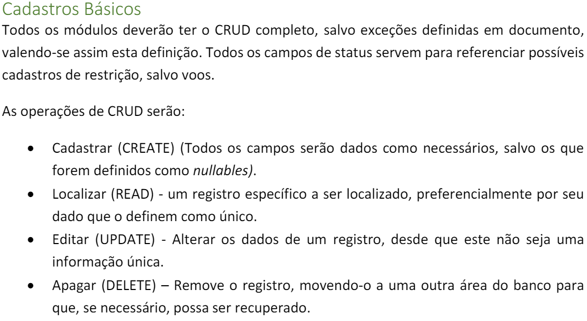
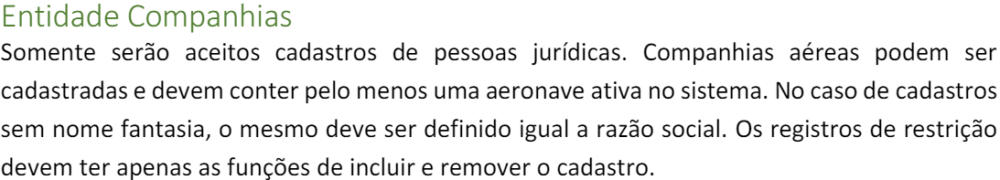
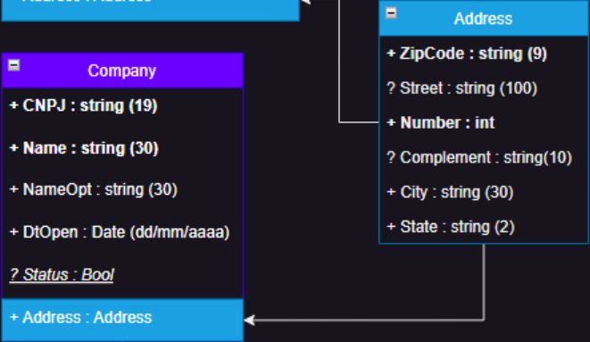

# 
5by5 ON THE FLY - COMPANY 

### 
Sobre o projeto

#### 
Um trabalho para praticar as ideias aprendidas no Módulo 3 de API da 5by5

### 
Tecnologias Utilizadas

- C#
- Mongo DB
- ASP.Net Core
- Docker

### 
Cadastro básico da Companhia

### 
Especificações da Companhia

### 
Diagrama da Companhia

## 
Feito por

#### - Ana Bordin (Delete)
#### - Gabriel Visicatto Soares (Get)
#### - Guilherme Satilio (Post)
#### - Juliana Mistron (Patch)
